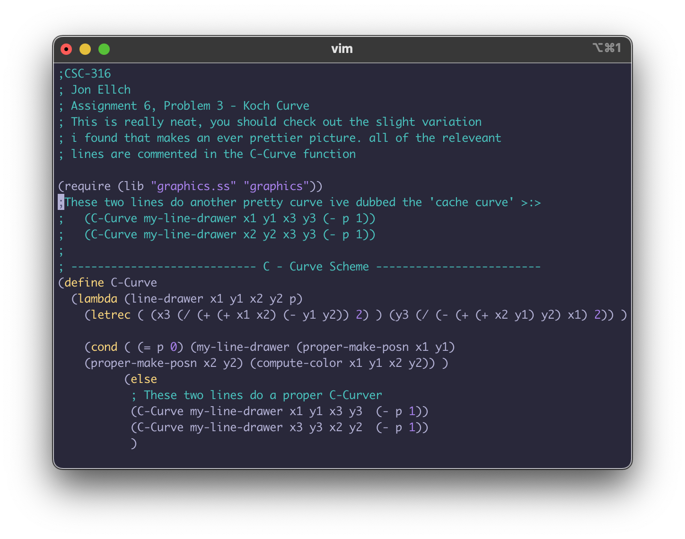
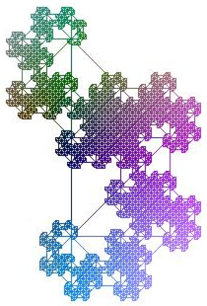

# pretty-fractcal

One time as a kid while trying to code a Koch Curve in scheme I thought i had stumbled across a cool new fractal.

Months later someone recognized it and referred me to the 'Jurassic Park' fractal.
I still like to think of it as the 'cache curve'

